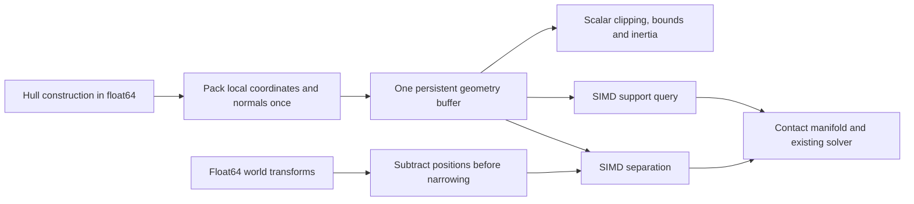

# Persistent packed physics investigation — 2026-10-01

The continued investigation and retained implementation are documented in [Solver, persistent caches and SIMD follow-up](go-server-solver-redesign-2026-10-01.md).

Persistent packing reduced the calculated storage of small float32 shapes and accelerated one hot kernel, but **did not establish a whole-server CPU saving across 1,024 measured sessions**. The longer two-core confirmation was effectively unchanged. The evidence shifts the next performance hypothesis toward batching independent constraints across islands, rather than repacking each small shape.

This follows the [precision investigation](go-server-precision-simd-2026-10-01.md). The baseline is the current uncommitted optimized server, including replication AVX2 and the supplied PGO. The investigation separates geometry representation, SIMD arithmetic, reduced precision, and solver-state placement. World positions remain float64 in every prototype. No workers or simulation threads were introduced.

## Research: which design transfers to this game?

[Box2D's SIMD solver article](https://box2d.org/posts/2024/08/simd-matters/) describes assigning contacts to persistent graph colors so contacts in a group do not modify the same body. SIMD then operates across contacts. This is useful on one core; threads are a separate choice. Copying its vector width without its dependency grouping would not copy the design.

[Box3D's collision study](https://box2d.org/posts/2026/07/simd-for-collision/) is a useful counterexample to assuming all packed geometry will be faster: its large gains involve 32-vertex, 89-edge hulls and thousands of edge combinations. The same optimization scarcely affected box-box collision. Our hot shapes have three or four vertices and no 3D edge-edge cross products. Its whole-simulation timings also change the contact solver SIMD mode, so they do not isolate collision packing.

[Bepu's architecture documentation](https://docs.bepuphysics.com/GettingStarted.html) describes splitting body data into buffers according to access patterns, using handles to find movable state, and storing constraints in arrays of structures of arrays. This is a substantially different design from adding a float32 cache beside each Go object. It also explains why a stable pointer to an individual body cannot simply become a pointer into a slice that may grow or compact.

[Jolt's large-world design](https://github.com/jrouwe/JoltPhysics/blob/master/Docs/Architecture.md#big-worlds) keeps high precision for global positions and uses offsets to permit local float calculations. That supports retaining float64 translations here while considering float32 local geometry. Its measured costs are for Jolt, not predictions for this server.

[Box2D's determinism discussion](https://box2d.org/posts/2024/08/determinism/) identifies fused operations, math-library differences and execution order as separate concerns. Our tests consequently distinguish agreement with old gameplay from agreement between the proposed Go and JavaScript arithmetic.

## What the current server actually does

`BaseShape` owns a slice of float64 two-coordinate vertices. `PolygonShape` adds a separate slice of normals. Construction computes a hull and its normals; ordinary motion changes body transforms without rebuilding local vertices. Destruction or changed colliders can rebuild shapes. Separation, GJK support queries, bounds, clipping and inertia calculation consume that geometry.

A body is 360 bytes and a contact is 640 bytes on this amd64 build. The body includes solver position/velocity, sweep caches, links and proxy state. The contact includes manifold data, solver parameters and list links. `SolveIsland` initializes constraints, performs eight velocity iterations, integrates motion, then performs position correction with an island-level early exit. Continuous collision has a separate TOI path. The high-level collision profile includes all this control flow, not just numeric vector operations.

The read-only audit ran 4- and 32-player versions of all four workloads for 120 warmup plus 900 measured ticks. Instrumentation was excluded from timed executables. Counters include warmup. The audit's greedy coloring is calculated for sizing only; it does not alter or time a new solver.

| Players | Scenario | Shapes constructed | Queried shapes | Separation queries | Mean axes evaluated |
| ------: | -------- | -----------------: | -------------: | -----------------: | ------------------: |
|       4 | convoy   |                 65 |              1 |                  3 |                3.00 |
|       4 | spread   |                189 |             48 |             26,640 |                2.10 |
|       4 | contact  |                 36 |             28 |             47,388 |                2.30 |
|       4 | module   |              4,562 |          1,717 |            147,088 |                2.28 |
|      32 | convoy   |                712 |            405 |            350,764 |                2.05 |
|      32 | spread   |              1,684 |            365 |            548,118 |                2.58 |
|      32 | contact  |                297 |            224 |            379,028 |                2.30 |
|      32 | module   |             36,482 |         14,966 |          1,682,613 |                2.22 |

The 32-player module run constructs 36,482 polygons, of which 14,966 are queried by the separating-axis routine. It makes 1,682,613 such queries—about 112 per queried polygon. Geometry can therefore be reused enough to amortize construction-time packing, but packing unused shapes also has a cost. Created shapes are mostly triangles and quadrilaterals; creation counts and query counts are different distributions.

Across these sampled workloads, local coordinates have magnitude below 310. The largest sampled float32 coordinate conversion error is 0.000014483 world units, versus current linear slop 0.5. This is encouraging evidence about these workloads, not a bound on all user-built craft or future content. Normals, transforms, support-index ties and accumulated dynamics still need separate validation; small vertex error does not bound long-run trajectory error.

## Implemented experiments

All prototypes replace or relocate the relevant source data. They do not merely add a cache while leaving every query to gather the original objects.

1. **Four-array geometry, float64 scalar:** replaces vector slices with persistent X, Y, normal-X and normal-Y arrays in one backing allocation, padded to four lanes. Keeps float64 arithmetic as the layout control.
2. **Four-array geometry, float64 SIMD:** adds a four-axis separation pipeline using AVX2. Loads the persistent arrays directly, transforms normals and vertices, projects the other polygon, then reduces distances. The wrapper preserves first-axis rejection selection and earliest-index ties, but the vector kernel evaluates all lanes before selecting the result.
3. **Four-array geometry, float32 scalar:** stores vertices and normals as float32; scalar consumers expand to float64 for existing arithmetic. This tests compact storage and its conversion cost without changing all intermediate operations to float32.
4. **Four-array geometry, float32 SIMD:** performs separation in four float32 lanes. Relative transforms are formed by subtracting world positions in float64 before narrowing. Other scalar geometry consumers read the same canonical float32 vertices.
5. **Flat-buffer geometry:** removes the four slice headers, retaining a single coordinate buffer and a stride. Hull construction writes this representation directly, eliminating the temporary ordered-vertex allocation. Both precision variants have a separation implementation.
6. **Flat-buffer pipelines:** reuse the same geometry for SIMD GJK support queries as well as separation. This tests reuse across different collision operations. Larger polygons and unsupported CPU paths retain scalar handling in the amd64 prototypes.
7. **Body solver-state pages:** moves the 48-byte solver position/velocity state out of each body into stable 64-slot pages. Bodies retain pointers to their slots. Destroyed bodies release slots to a free list, which clears reused state. This is a locality control with unchanged scalar math, not a wide SIMD solver.

Four lanes are deliberate for individual triangles/quadrilaterals: eight lanes would not supply eight independent axes. The float32 kernel uses 128-bit VEX instructions; the float64 version uses 256-bit AVX. Packing multiple shape pairs together is a different design requiring a collision work queue, mask handling and ordered manifold delivery.

The implemented data flow is:



## Memory accounting

| Layout                  | Polygon header | Triangle payload | Header + triangle payload | Header + quadrilateral payload |
| ----------------------- | -------------: | ---------------: | ------------------------: | -----------------------------: |
| Current float64 vectors |          104 B |             96 B |                     200 B |                          232 B |
| Four-array float64      |          152 B |            128 B |                     280 B |                          280 B |
| Four-array float32      |          152 B |             64 B |                     216 B |                          216 B |
| Flat float64            |           88 B |            128 B |                     216 B |                          216 B |
| Flat float32            |           88 B |             64 B |                     152 B |                          152 B |

These are layout calculations for this 64-bit build. The flat float32 representation reduces header-plus-payload storage by 24% for a triangle and 34.5% for a quadrilateral.

Payload bytes exclude allocator size classes and the optional bounds cache. They are not RSS predictions. Padding and slice headers matter: four float32 slice headers can erase the savings for tiny shapes. The flat-buffer variant addresses that directly. Body pages add a state pointer, page ownership and a free list; separating hot state does not automatically reduce total bytes or improve access latency.

## Representation choice

The useful float32 boundary is **shape-local or pair-relative data**. Casting two large world positions to float32 and then subtracting them is different from subtracting in float64 and narrowing the small difference. These prototypes use the latter for separation. They do not quantize accumulated global position, velocity, or angle each tick.

A global switch from Go `float64` to `float32` would also change geometry construction, normalization, mass/inertia and the iterative solver. The tested geometry variants deliberately do less. TypeScript `number` still stores these values as doubles unless typed arrays are used; matching server rounding does not require copying its storage layout.

FP16 or small fixed-point coordinates are possible storage experiments, but are not tested here. Standard AVX2/F16C half-precision support is conversion support, not a general half-precision physics arithmetic path; [Intel documents separate conversion and FP16 arithmetic instruction requirements](https://www.intel.com/content/www/us/en/docs/oneccl/developer-guide-reference/2021-13/low-precision-datatypes.html). Packed integers also require overflow/range rules and conversions or rewritten normalization/division. Neither follows automatically from the float32 results. Prefer a measured float32 design with an explicit absolute-error budget before adding these formats.

## Measurements

| Experiment                                                                                                                     | Repetitions / ticks | Mean CPU change | Aggregate CPU change |
| ------------------------------------------------------------------------------------------------------------------------------ | ------------------: | --------------: | -------------------: |
| [Four-array float64, scalar](../../benchmarking/results/2026-10-01-cpu-packed-f64-scalar.json.gz)                                 |             3 / 900 |          -0.06% |               +0.86% |
| [Four-array float64, SIMD separation](../../benchmarking/results/2026-10-01-cpu-packed-f64-simd.json.gz)                          |             3 / 900 |          +0.87% |               +0.20% |
| [Four-array float32, scalar consumers](../../benchmarking/results/2026-10-01-cpu-packed-f32-scalar.json.gz)                       |             3 / 900 |          -0.95% |               +1.04% |
| [Four-array float32, SIMD separation](../../benchmarking/results/2026-10-01-cpu-packed-f32-simd.json.gz)                          |             3 / 900 |          -0.25% |               +0.30% |
| [Flat float64, SIMD separation](../../benchmarking/results/2026-10-01-cpu-packed-flat-f64-simd.json.gz)                           |             3 / 900 |          +0.87% |               +0.33% |
| [Flat float32, SIMD separation](../../benchmarking/results/2026-10-01-cpu-packed-flat-f32-simd.json.gz)                           |             3 / 900 |          -0.66% |               -0.07% |
| [Flat float64, separation + support](../../benchmarking/results/2026-10-01-cpu-packed-flat-f64-pipeline.json.gz)                  |             3 / 900 |          -0.22% |               -0.65% |
| [Flat float32, separation + support](../../benchmarking/results/2026-10-01-cpu-packed-flat-f32-pipeline.json.gz)                  |             3 / 900 |          -2.10% |               -0.18% |
| [Paged body solver state](../../benchmarking/results/2026-10-01-cpu-packed-bodies.json.gz)                                        |             3 / 900 |          -0.34% |               -0.08% |
| [Flat float64 pipeline: longer two-core confirmation](../../benchmarking/results/2026-10-01-cpu-packed-confirm-two-cores.json.gz) |            5 / 3000 |          +0.39% |               -0.03% |

The nine screening comparisons total 864 measured processes. The follow-up adds 160 processes, for **1,024 measured sessions**. The longer test uses five repetitions, 3,000 ticks, GOMAXPROCS=2 and affinity to CPUs 0 and 1 for both sides, comparing the exact same baseline and flat-float64-pipeline binaries. It measures **−0.027% aggregate CPU** and **+0.395% equal-scenario mean CPU**, with strict outcomes matching. This is no established gain. An exploratory paired bootstrap (10,000 resamples within each scenario, recomputing the median aggregate) gives a 95% interval of **-0.43% to +0.42%**. It describes repeat variability on this machine, not uncertainty across CPUs or production workloads.

Negative CPU change is better. Mean gives every scenario equal weight; aggregate divides sums of per-scenario median CPU time. The screening runs use three paired repetitions, 900 ticks after 120 warmup, all 16 scenarios, GOGC=800, GOMAXPROCS=1 and CPU affinity 0. All use the same PGO, without retraining for the prototype. Builds, instrumentation runs and tests are outside timed session measurements. Near-zero point estimates are inconclusive.

Float64 and body-layout comparisons require contact, event, entity and packet counts plus final states to agree. Float32 comparisons record changed outcomes rather than rejecting an allowed change to old trajectories. This also means their timing differences include changed downstream gameplay work, not just instruction savings. They cannot be read as isolated hardware speedups.

The isolated float32 triangle kernel has a median of 20.46 → 13.96 ns for overlap, approximately 32% less time, but 9.211 → 10.96 ns for first-axis rejection, approximately 19% more. Those are five pinned, single-thread microbenchmark repetitions at 200 ms each. The reference uses matching float32 operation boundaries; neither side packs geometry in the query. This demonstrates a real local gain and explains why it need not survive the whole pipeline.

## Solver batching: the remaining structural opportunity

Within-island batching wastes most lanes in these workloads. A body appears in several consecutive contacts and many islands are tiny. Across the whole world the situation improves, but depends strongly on workload.

| Players | Scenario | 4-lane occupancy, within islands | 4-lane occupancy, whole world | 8-lane occupancy, whole world |
| ------: | -------- | -------------------------------: | ----------------------------: | ----------------------------: |
|       4 | spread   |                            25.0% |                         25.0% |                         12.5% |
|       4 | contact  |                            25.0% |                         50.0% |                         25.0% |
|       4 | module   |                            25.6% |                         55.6% |                         29.1% |
|      32 | convoy   |                            38.6% |                         56.3% |                         32.9% |
|      32 | spread   |                            25.0% |                         50.7% |                         25.6% |
|      32 | contact  |                            25.0% |                        100.0% |                        100.0% |
|      32 | module   |                            28.2% |                         69.0% |                         47.3% |

These are contact counts divided by padded color-group capacity, before splitting one- and two-point constraints or measuring gather/scatter cost. The numbers are therefore optimistic for a specialized kernel. Greedy graph colors also reorder contacts that share a body across colors; that ordering must become part of the TypeScript contract. A dependency-preserving schedule is an alternative but may pack fewer lanes. Simply solving arbitrary contacts in parallel lanes is incorrect because one contact's updated velocity feeds the next.

The audit does not implement persistent colors, a packed constraint solver or an across-island solver schedule. It establishes whether these are plausible next targets. A complete implementation would need to maintain groups as contacts enter/leave, refresh their numeric parameters once per step, preserve mixed one-/two-point behavior, and handle TOI separately. Those costs must be measured rather than inferred from lane occupancy.

## Precision and client agreement

Global positions stay float64. Relative translations are computed before conversion, so nearby shapes at a large world offset do not lose their separation merely because the offset is large. Local geometry needs an explicit supported-range/error contract before production adoption; current sampled bounds are not that contract.

For float32 storage with float64 arithmetic, JavaScript can quantize vertices and normals once at the same construction boundary. For float32 SIMD arithmetic, JavaScript also needs `Math.fround` at every corresponding add, subtract and multiply. Rounding once after an expression is not equivalent. Fused multiply-add must either be avoided consistently or implemented with matching semantics on the client. Creation order, tie selection, stale-cache invalidation and contact scheduling are separate from numerical precision.

Validation performed:

- Four-array float32 separation passed 50,000 randomized scalar/SIMD comparisons. The flat float32 pipeline passed 50,000 separation and 50,000 support-index comparisons. Separation cases include world offsets of 0, 10 million and 20 million, with the same local-size shapes.
- The flat float64 pipeline passed the collision and physics suites, including the corresponding randomized tests and existing shared fixtures.
- The body-state prototype passed the physics suite and a repeated allocate/release test checking that reused slots are cleared, live state is not aliased, and a small fixed live population does not grow the pool.
- The [JavaScript kernel reference](../../benchmarking/experiments/packed-physics-parity.mjs) reproduced all 1,000 supplied-transform Go cases with zero numeric or selected-axis differences. Input float32 arrays must also be rounded after decoding their JSON decimal representations. This is kernel parity, **not full changed-simulation parity**; it does not cover TypeScript's own transform generation, every boundary case, or browser engines.
- Production builds before/after passed. Lint passed with the same two existing `unicorn(no-new-array)` warnings. Production source, PGO and bundles are unchanged: entry 115,157 B / 50,909 B gzip, docked 4,708 / 2,431, sound 1,681 / 942, Node server 100,475 / 43,458.

See the [kernel timings](../../benchmarking/results/2026-10-01-packed-geometry-kernel.txt), [geometry/island audit](../../benchmarking/results/2026-10-01-packed-physics-audit.json), [whole-world batch audit](../../benchmarking/results/2026-10-01-packed-physics-world-audit.json), and [kernel parity summary](../../benchmarking/results/2026-10-01-packed-physics-parity.json). The source patches are linked below; no approximate prototype has been promoted to production.

## Artifacts and reproduction

All `packed-physics-2026-10-01-*.patch` files in [experiments](../../benchmarking/experiments) apply independently to the uncommitted source used by this investigation. They are experimental code, not a supported production build matrix. The SIMD geometry files target the experimental amd64 toolchain; a production change would need normal build-tag fallbacks and architecture validation. Patches, raw results and executable hashes preserve each tested checkpoint.

```sh
# Apply one patch in a separate copy of the starting source, then compile there:
GOCACHE=/tmp/unicorn-precision-go-cache GOEXPERIMENT=simd \
  go test -pgo=cmd/go-server/default.pgo -c -o /tmp/go-packed-candidate ./internal/server
# Run the paired driver from the main checkout:
BEFORE_GOGC=800 AFTER_GOGC=800 REPETITIONS=3 TICKS=900 \
  node benchmarking/go-cpu-paired.mjs cpu-packed-recheck /tmp/go-precision-before /tmp/go-packed-candidate
# Add OUTCOME_COMPARISON=report for intentionally changed float32 rules.
```

## Assessment

Persistent packing is feasible, float32 local geometry has a small sampled error, and the overlapping-triangle kernel is faster. But **none of the tested layouts establishes a whole-server CPU improvement**. The best unchanged-arithmetic screen was −0.65% aggregate; its longer two-core confirmation was effectively zero. The reduced-precision variants also change later gameplay work, and their aggregate CPU changes remain around zero or worse.

The promising memory representation is a single flat float32 buffer, which avoids duplicated geometry and slice headers. That is a measured design property, not a demonstrated CPU saving. Global positions should remain float64, with narrowing after relative subtraction. A rollout would still require a defined local range, bounded errors for all operations, a float32-equivalent scalar fallback, ARM64/build-tag support, and full Go/TypeScript simulation parity. The experimental float32 fallback currently uses the old widened scalar arithmetic, so its ISA-dependent rules are not production-ready.

The next larger performance hypothesis is **four-wide independent contact constraints batched across islands**, with persistent scheduling and packed parameters reused through the velocity iterations. Eight-wide should be selected only when occupancy supports it. This follows from the audit and the cited engine designs; it is not a measured speedup here. It would change solver organization and potentially iteration order, requiring coordinated TypeScript work. Merely relocating body fields, switching numeric types, or packing each small polygon has now been tested and has not delivered the hoped-for CPU reduction.

Production calculations and CPU settings are unchanged. Experimental implementations, audits and validation tools are retained so this evidence can guide a larger solver redesign without repeating these layout experiments.
